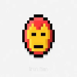

# 📝 Note & URL Manager — Chrome Extension



A powerful Chrome extension for taking notes and organizing URLs into customizable groups. Perfect for researchers, developers, and anyone who needs to manage web resources efficiently.

---

## 🌟 Features

### 📝 Smart Note Taking

* Write and save notes that persist across sessions
* Auto-save every 5 seconds
* Character count display
* Keyboard shortcuts (`Ctrl + S` to save)

### 📁 Advanced URL Organization

* Create unlimited URL groups (e.g., YouTube, Research, Work)
* Add up to 10 URLs per group
* One-click addition of current page
* Manual URL entry with validation
* Expandable / collapsible group view

### 🎨 Beautiful Interface

* Modern gradient design with smooth animations
* Responsive layout for side panel
* Font Awesome icons
* Color-coded notifications
* Intuitive drag-and-drop-like experience

### 💾 Reliable Storage

* Chrome Storage API for data persistence
* Sync across devices (when signed into Chrome)
* No tracking prevention issues
* Backup and restore ready

---

## 📸 Screenshots

### Main Interface


### URL Groups


### Add URL Modal


---

## 🚀 Installation

### Method 1 — Load Unpacked (Development)

1. Clone or download this repository
2. Open Chrome and go to:

   ```
   chrome://extensions/
   ```
3. Enable **Developer mode** (top-right toggle)
4. Click **Load unpacked**
5. Select the `note-url-extension` folder
6. Pin the extension to your toolbar for easy access 📌

### Method 2 — Chrome Web Store

> Coming soon after publishing

---

## 📖 How to Use

### Taking Notes

1. Click the extension icon in your toolbar
2. The side panel will open
3. Type your notes in the text area
4. Notes auto-save every 5 seconds, or click **Save Note**

### Creating URL Groups

1. Click **New Group**
2. Enter a group name (e.g., `YouTube`, `Research Papers`)
3. Click **Create** or press `Enter`
4. Your new group will appear in the list

### Adding URLs

#### Method 1 — Current Page

1. Navigate to any webpage
2. Open the extension
3. Click **Add to Group**
4. Select a group
5. Click **Save URL**

#### Method 2 — Manual Entry

1. Click **+ Add URL** next to any group
2. Enter the URL title and address
3. Select destination group
4. Click **Save URL**

### Managing URLs

* **Open URL** → Click the external link icon (↗️)
* **Delete URL** → Click the trash icon (🗑️)
* **Delete Group** → Click the group’s trash icon
* **Expand / Collapse** → Click the group name

---

## 🛠️ Technical Details

### File Structure

```
note-url-extension/
├── manifest.json          # Extension configuration
├── sidepanel.html       # Main interface
├── sidepanel.js         # Core functionality
├── style.css           # Styling
└── icons/              # Extension icons
    ├── icon16.png     # Toolbar icon
    ├── icon48.png     # Extension page icon
    └── icon128.png   # Store listing icon
```

### Technologies Used

* **Manifest V3** — Latest Chrome extension API
* **Vanilla JavaScript** — No frameworks required
* **Chrome Storage API** — Secure data persistence
* **Font Awesome** — Beautiful vector icons
* **CSS3 Animations** — Smooth user experience

### Permissions

* `storage` → Save notes and URL groups
* `tabs` → Access current page information
* `sidePanel` → Open in Chrome's side panel
* `<all_urls>` → Add URLs from any website

---

## 🔧 Development

### Prerequisites

* Basic knowledge of HTML, CSS, and JavaScript
* Chrome browser (version 88 or later)
* Text editor (VS Code recommended)

### Local Development

1. Fork and clone the repository
2. Make changes to the source files
3. Reload the extension in:

   ```
   chrome://extensions/
   ```
4. Test your changes

### Building Icons

Create icons in three sizes:

* `16x16` pixels — Toolbar icon
* `48x48` pixels — Extension management
* `128x128` pixels — Store listing

Tools you can use:

* Favicon Generator
* Canva
* Adobe Express

---

## 🤝 Contributing

Contributions are welcome! 🚀

### How to Contribute

1. Fork the project
2. Create a feature branch

   ```bash
   git checkout -b feature/AmazingFeature
   ```
3. Commit changes

   ```bash
   git commit -m "Add AmazingFeature"
   ```
4. Push to branch

   ```bash
   git push origin feature/AmazingFeature
   ```
5. Open a Pull Request

### Code Style

* Use meaningful variable names
* Comment complex logic
* Follow existing structure
* Test thoroughly before submitting

---

## 📋 To-Do Features

* Import / export functionality
* Search within notes and URLs
* Tag system for URLs
* Dark mode toggle
* Keyboard navigation
* Drag-and-drop URL sorting
* Group color customization
* URL favicon display
* Note formatting options
* Backup to Google Drive

---

## 🐛 Troubleshooting

### Common Issues

**Extension not appearing in toolbar**

* Go to:

  ```
  chrome://extensions/
  ```
* Find **Note & URL Manager**
* Click the pin icon (📌)

**Data not saving**

* Ensure you're signed into Chrome
* Check storage permissions
* Try reinstalling the extension

**Side panel not opening**

* Update Chrome to latest version
* Restart Chrome
* Check for conflicting extensions

**URLs not adding**

* Verify URL format (must start with `http://` or `https://`)
* Check group isn't full (max 10 URLs)
* Ensure extension has necessary permissions

### Debugging

* Open Developer Tools in the side panel
* Check Console for errors
* Look for storage-related issues
* Verify network permissions if using external resources

---

## 📄 License

This project is licensed under the **MIT License** — see the `LICENSE` file for details.

---

## 🙏 Acknowledgments

* Chrome Extension Documentation
* Font Awesome for icons
* Stack Overflow community
* All contributors and testers

---

## 📞 Support

Found a bug or have a feature request?

* Check **Issues**
* Create a new issue with details
* Include Chrome version and steps to reproduce

---

## 🌟 Star History


---

> Made with ❤️ for the Chrom
